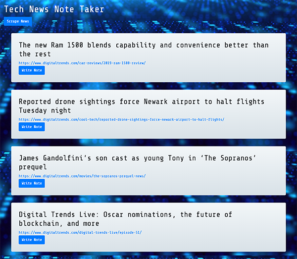

# Tech-News-Note-Taker

### Overview

In this project, I utilized Mongoose and Cheerio to scrape news from another webiste, created a web app to let users view the news and leave their notes.

### Technologies

* Express.js
* MongoDB
* Mongoose
* mLab
* Morgan
* Node.js
* Cheerio
* Axios
* Bootstrap
* jQuery
* Heroku

### Deployed Link

https://tech-news-note-taker.herokuapp.com

